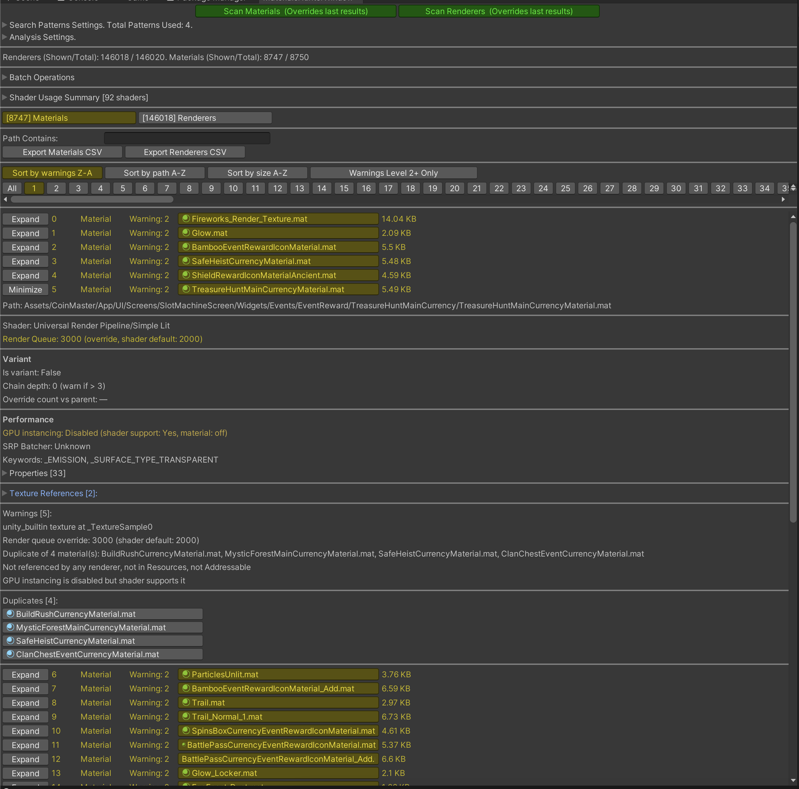

# Materials Hunter Unity3D Tool 

`MaterialsHunter` is a tool for Unity that scans project assets for:

- Renderer-side material issues (missing refs, built-in fallback materials).
- Material-side quality/performance risks (missing shader/texture links, duplicate materials, unused materials, variant complexity, instancing/SRP batcher concerns).
- Cross-references (which renderers use which materials, which materials use which textures).

All code combined into one script for easier portability.
So you can just copy-paste [MaterialsHunter.cs](./Editor/MaterialsHunter.cs) to your project in any Editor folder.

## Quick start

Use "Tools/Materials Hunter" to open the window.

Recommended workflow:

- Run material collection to inspect material assets, shader links, texture slots, duplicates, variants, and batching-related warnings.
- Run renderer collection to inspect scene and prefab renderer material slots.
- Sort by warnings and use path filters to narrow the result set.
- Use batch operations only after reviewing the filtered targets.
- Enable `Just log (dry run)` before applying batch changes to preview the exact actions in the Console.

---

## Analyzed Issues Description

### Renderer warnings

#### `Null material`
- A renderer has no `sharedMaterials` entries at all.
- The object may render incorrectly, use fallback behavior, or be visually broken depending on pipeline/shader setup.

#### `Null material slot`
- A renderer has at least one `null` entry inside `sharedMaterials`.
- Mesh submesh-to-material mapping can become inconsistent; some parts may render incorrectly.

#### `unity_builtin material at <TransformFullName>`
- Renderer references a Unity built-in/internal material (`unity_builtin` path).
- Built-in fallback/internal materials are often not intended for production content consistency.

---

### Material warnings

#### `Unable to load`
- Material asset could not be loaded by `AssetDatabase`.
- Asset may be missing, broken, or blocked by import/compilation issues.

#### `Texture is null at <PropertyName>`
- A shader texture property on material is unassigned (`null`).
- Can produce incorrect visuals (missing maps, flat lighting, etc.).

#### `unity_builtin texture at <PropertyName>`
- A texture property resolves to Unity built-in/internal texture.
- Built-in placeholders/defaults are often unintended in final art.

#### `Shader is null`
- Material has no shader reference.
- Material cannot render correctly.

#### `Shader is missing (InternalErrorShader)`
- Unity substituted missing shader with `Hidden/InternalErrorShader`.
- Shader is broken/missing for this project/pipeline.

#### `Built-in shader`
- Material uses a built-in shader name from tool’s built-in shader list.
- May violate project shader standards or reduce pipeline consistency.

#### `Render queue override: <Queue> (shader default: <DefaultQueue>)`
- Material render queue differs from shader default.
- Can affect draw order and transparency sorting behavior.

#### `Duplicate of N material(s): <Names...>`
- Material fingerprint matches other materials (same shader/properties/keywords/etc.).
- Duplicate materials increase maintenance and memory/asset noise.

#### `Not referenced by any renderer, not in Resources, not Addressable`
- Material has no detected renderer references and is neither in `Resources` nor Addressables.
- Strong candidate for dead/unused content.

---

### Variant and performance-related warnings

#### `Material variant: parent is missing or invalid`
- Variant parent cannot be resolved (API/serialized parent link invalid).
- Inheritance chain is broken; final values may be wrong.

#### `Variant chain depth D exceeds threshold T`
- Computed variant-parent chain depth exceeds configured threshold.
- Deep chains are hard to reason about and maintain.

#### `Heavy variant overrides: C (threshold T)`
- Count of overrides vs parent exceeds threshold.
- Variant may be too different from parent; standalone material can be clearer.

#### `GPU instancing is disabled but shader supports it`
- Shader supports instancing but material has `enableInstancing == false`.
- Missed batching/draw-call optimization opportunity.

#### `Shader "<ShaderName>" is not SRP Batcher compatible`
- Shader reported as incompatible with SRP Batcher.
- Potential CPU/render-thread overhead vs SRP-batcher-friendly shaders.

---

## Batch Operations

Batch operations run on renderer targets selected by:

- Current renderer filters (if `Apply to filtered` is enabled), or
- All scanned renderers.

All operations support:

- **Dry run:** via `Just log (dry run)` (no asset writes, only impact reporting).

Safety notes:

- Prefer running with `Just log (dry run)` first.
- Batch operations can save changed prefabs, scenes, and material assets.
- When `Apply to filtered` is enabled, current renderer filters define the target set.
- Re-run collection after large changes to refresh warnings and references.

### 1) Replace material (`Apply: Replace source -> target`)

- **What it does:** For each targeted renderer, replaces every slot where `sharedMaterials[i] == source` with `target`.
- **Preconditions:**
  - Renderer scan results must exist.
  - Material scan results must exist.
  - Source and target materials must be assigned.
- **Typical use:** Migrate from deprecated material to approved replacement in bulk.

### 2) Replace `unity_builtin` materials (`Apply: Replace unity_builtin`)

- **What it does:** Replaces renderer material slots whose asset path contains `unity_builtin` with chosen fallback material.
- **Preconditions:**
  - Renderer scan results must exist.
  - Material scan results must exist.
  - Fallback material must be assigned.
- **Typical use:** Remove accidental fallback/internal materials from prefabs.

### 3) Remove null material slots (`Apply: Remove null slots`)

- **What it does:** Compacts each targeted renderer’s material array by removing all `null` entries.
- **Preconditions:**
  - Renderer scan results must exist.
- **Typical use:** Clean broken/incomplete renderer slot arrays after content changes.

### 4) Fix missing shaders (`Apply: Fix missing shaders`)

- **What it does:** For unique materials found on targeted renderers, if shader is missing (`null`) or `InternalErrorShader`, assign selected fallback shader.
- **Preconditions:**
  - Renderer scan results must exist.
  - Material scan results must exist.
  - Fallback shader must be assigned.
- **Typical use:** Rapid recovery after shader package/pipeline migration or broken shader references.

---

## Output and export

The results have separate Materials and Renderers views.
Both views support path filtering, warning filters, sorting, and pagination for large projects.

Use `Export Materials CSV` to write the currently filtered material rows.
Use `Export Renderers CSV` to write the currently filtered renderer rows.
Exports are useful for review outside Unity or for comparing results after cleanup.

## Limitations and interpretation notes

- `Duplicate of N material(s)` is a candidate warning, not always an error. Some duplicate-looking materials may be intentionally separated for ownership, variants, or future edits.
- `Not referenced by any renderer, not in Resources, not Addressable` means the material was not found by this tool's scanned renderer/reference model. Runtime loading, custom registries, string paths, or external build systems can still use it.
- Addressables and build-layout information require the matching defines/integrations described below.
- Renderer-side warnings depend on the scenes and prefabs the tool can load and inspect in the editor.

---

## Additional Defines

- **#define** HUNT_ADDRESSABLES to enable addressables settings detection for each asset
- **#define** HUNT_LAYOUT to enable integration with BuildLayout.txt analysis and detection bundle for each asset (requires third-party package)

---

## Installation

1. Using Unity's Package Manager.
- Use this URL https://github.com/AlexeyPerov/Unity-Materials-Hunter.git.
2. You can also just copy and paste file [MaterialsHunter.cs](./Editor/MaterialsHunter.cs) inside Editor folder

---

## Contributions

Feel free to report bugs, request new features
or to contribute to this project!

---

## Other tools

##### Dependencies Hunter

- To find unreferenced assets in Unity project see [Dependencies-Hunter](https://github.com/AlexeyPerov/Unity-Dependencies-Hunter).

##### Addressables Inspector

- To analyze addressables layout [Addressables-Inspector](https://github.com/AlexeyPerov/Unity-Addressables-Inspector).

##### Missing References Hunter

- To find missing or empty references in your assets see [Missing-References-Hunter](https://github.com/AlexeyPerov/Unity-MissingReferences-Hunter).

##### Textures Hunter

- To analyze your textures and atlases see [Textures-Hunter](https://github.com/AlexeyPerov/Unity-Textures-Hunter).

##### Asset Inspector

- To analyze asset dependencies [Asset-Inspector](https://github.com/AlexeyPerov/Unity-Asset-Inspector).

##### Editor Coroutines

- Unity Editor Coroutines alternative version [Lite-Editor-Coroutines](https://github.com/AlexeyPerov/Unity-Lite-Editor-Coroutines).
- Simplified and compact version [Pocket-Editor-Coroutines](https://github.com/AlexeyPerov/Unity-Pocket-Editor-Coroutines).

